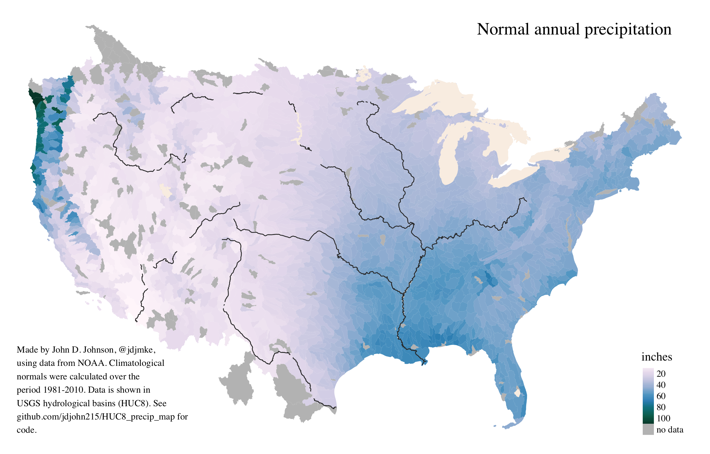
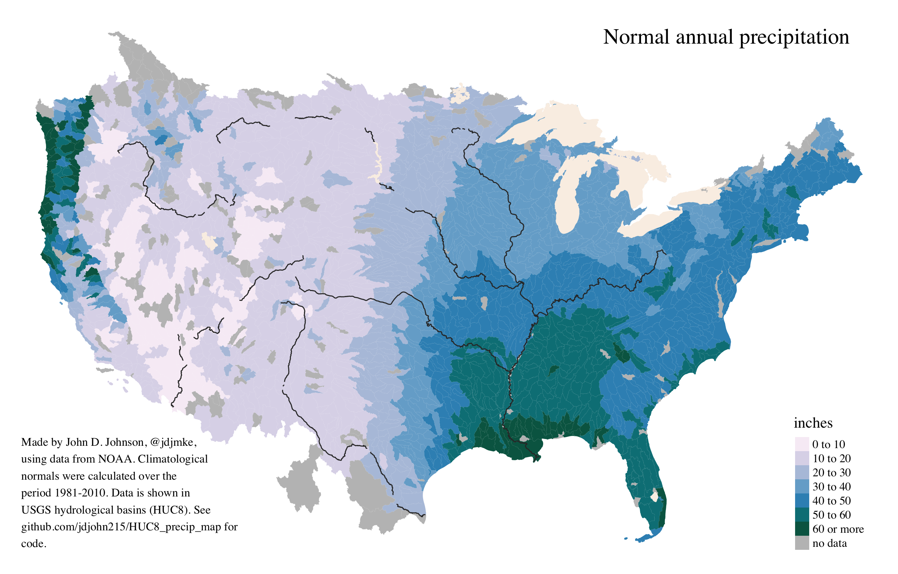

This repo contains all the data and code you need to build these two maps in R using the [`tmap` package](https://github.com/mtennekes/tmap).

There are 3 R scripts.

* [**Step 1**](R/step1_retrieve_normals.R) shows how to retrieve climatological normals from the NOAA FTP server. By following this template, you can also download loads of other regularly updated weather and climate data.
* [**Step 2**](R/step2_calculate_stats_by_huc8.R) shows how to intersect point data with polygon data to calculate summary statistics.
* [**Step 3**](R/step3_build_maps.R) builds the maps themselves.

## continuous scale

## binned scale

